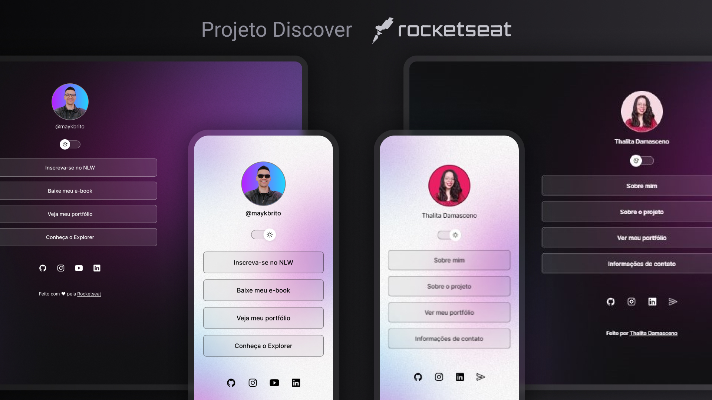

<h1 align="center"> Discover </h1>

É um programa exclusivo e gratuito, promovido pela Rocketseat para ensino de tecnologias WEB.  
Você também pode conhecer e participar desse projeto <a href="https://www.rocketseat.com.br/discover?utm_source=instagram&utm_medium=maykbrito&utm_campaign=divulgacao&utm_term=organic&utm_content=instagram-do-mayk">clicando aqui.</a>

  <a href="#-tecnologias">Tecnologias</a>&nbsp;&nbsp;&nbsp;|&nbsp;&nbsp;&nbsp;
  <a href="#-projeto">Projeto</a>&nbsp;&nbsp;&nbsp;|&nbsp;&nbsp;&nbsp;
  <a href="#-layout">Layout</a>&nbsp;&nbsp;&nbsp;|&nbsp;&nbsp;&nbsp;
  <a href="#memo-licença">Licença</a>

  

 

  

## 🚀 Tecnologias

Esse projeto foi desenvolvido com as seguintes tecnologias:

- HTML e CSS
- JavaScript
- Git e Github
- Figma

## 💻 Projeto

Esse projeto é um agregador de links, uma ferramenta que simplifica a maneira de compartilhar suas informações agrupando vários links em uma única URL de forma prática e organizada. Pode servir como um cartão de visita para apresentar seus principais canais de comunicação ou outras informações relevantes para seu público, seja para uso pessoal ou profissional.

- [Acesse o projeto finalizado online](https://thalitaad.github.io/agregador-de-links/)

## 🔖 Layout

Você pode visualizar o layout do projeto através [desse link](https://www.figma.com/community/file/1187422022288947321). É necessário ter conta no [Figma](https://figma.com) para acessá-lo.

## :memo: Licença

Esse projeto está sob a licença MIT.

---

Feito com ♥ by Thalita Damasceno and Rocketseat :wave: [Participe da comunidade Rocketseat!](https://discord.gg/rocketseat)